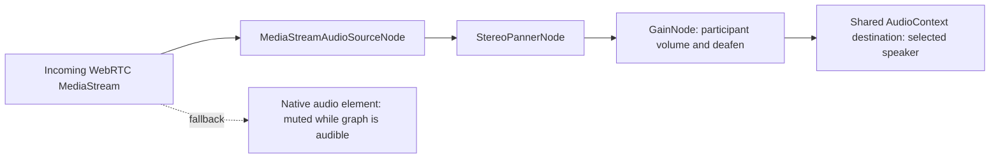

# Table Mode / Spatial Audio

Open **Your table** in the voice call toolbar for the listener's table editor.
Select an avatar (or use the participant picker), adjust their left/right position,
swap seats, and change stereo width. Choose a **Dungeon Master**, including yourself.
A remote DM stays centred across from you; choosing yourself retains your listener
seat. Reset seating restores automatic placement and full width, retaining the DM.
The avatar preview shows seat assignments; stereo width controls how strongly those
positions are heard. Sliders and selects also make overlapping seats accessible in
large groups. The dialog supports keyboard navigation, Escape, and focus restoration.

Seating and DM selection belong to this listener and reset when changing rooms.
Width lasts for this session. The spatial toggle is saved on this device and is
also available in **Settings → Voice**. No server role or permission changes.

**Speak important** in the call toolbar is a speaker-controlled toggle. It broadcasts
an optional `important` boolean in `voice-state`, relayed in the participant roster.
Listeners centre that microphone and apply an 8% gain boost (amplitude, not pitch),
even with their own spatial setting off. The toolbar, participant tile, and room
banner indicate the active state. Click again or use **Finish** to return to normal.
Mute, deafen, moderator mute, leaving, and rejoining clear the server's flag. It never
opens a muted microphone or bypasses push-to-talk. Several people may use it at once;
it is an emphasis control, not an exclusive floor or moderation permission.

## Audio graph

Each incoming microphone stream has this playback graph when enabled:



The React adapter is `app/components/remote-voice-audio.tsx`; the reusable engine
and pure layout helpers are in `app/lib/spatial-audio.ts`. One engine/context lives
for each joined room. `useVoice` continues to own the received tracks, microphone,
WebRTC senders, speaking meters and recording streams. Recording does not inherit
the listener's spatial mix. Music bots and screen/camera streams use native stereo
playback and do not consume seats.

The engine connects directly to the output, without MediaRecorder, a worklet,
a MediaStream destination, or additional application queues. `latencyHint` is
`interactive`. Web Audio and hardware still have rendering/output latency; literal
zero additional latency cannot be promised. See the
[Web Audio specification](https://webaudio.github.io/web-audio-api/#latency).

## Seating math

The listener is `(0, 0, 0)`, facing negative Z (bottom centre in a plan view).
`tableSeat(index, count, isHost)` returns `{ pan, x, y, z }`. Count/index refer to
remote seats, excluding a separately designated host. A host is `(0, 0, -1.5)`.

For paired seats, with zero-based pair index `k` and `P = floor(count / 2)`:

```
theta = side * ((k + 1) / P) * pi / 3
x = 1.5 * sin(theta)
y = 0
z = -1.5 * cos(theta)
pan = 0.65 * sin(theta)
```

Pairs alternate left/right in observed room join order. Without a designated
host, an odd final seat occupies the centre. With a host, an odd non-host count
uses the next even number of slots, leaving one vacant slot and reserving the
centre for the host. This ensures distinct pans including for two-person calls.
`tableLayout(ids, hostId)` handles the reservation and absent hosts.

Roster metadata updates preserve observed order. Membership changes recalculate
spacing; some seats necessarily move on departures or odd/even changes. Each pan
uses `setTargetAtTime` with a 60 ms time constant (about 95% of a move in 180 ms).
Prior automation is held/cancelled before a new target is scheduled. There is no
animation loop. Reconnection with a new connection ID counts as a new arrival.

All seats lie at radius 1.5, so distance attenuation is unity at that reference
radius. This deliberately avoids making distant voices harder to understand.
The greatest absolute pan is about 0.563, keeping mono voice energy in both ears.
The browser's equal-power stereo panner supports stereo input without forcing a
mono downmix. It changes the stereo image; it is not an HRTF renderer and adds no
interaural delay or front/back cues. See
[StereoPannerNode](https://webaudio.github.io/web-audio-api/#StereoPannerNode).
`personalTableLayout` applies listener overrides and stereo width after automatic
seating, with bounded pans and a fixed DM centre. UI and playback share one observed
join order from `useVoice`. Seat sliders and swaps are implemented; dragging and
HRTF are not.

## Toggle, fallback and ownership

`SpatialAudioPlayback.update(inputs, enabled)` reconciles streams and controls
volume, mute and seat targets. OFF immediately restores native stereo for normal
voices. Important microphones retain the graph until the speaker finishes. Neither
control renegotiates a peer connection. Deafen and individual mute silence both paths. Position changes
are smoothed; volume changes use a 25 ms time constant; mute and bypass are immediate.
Important microphones temporarily use explicit mono input on the stereo panner to
send an identical voice image to both ears, then restore stereo channel handling.
The boost multiplies the listener's existing volume by 1.08. Local mute and deafen
still silence both output paths. When the graph is unavailable, native fallback
volume is capped at 1, so it cannot boost already-full-volume audio or downmix a
stereo microphone. The original audio remains audible in that case.

If Web Audio creation, a per-stream node, context resume, or speaker routing is
unavailable, native playback remains available. A suspended/interrupted context
also restores the native path. Pointer/keyboard gestures retry resume. Speaker
changes temporarily restore native playback until the context has successfully
selected the new output. A non-default speaker without AudioContext `setSinkId`
support uses native playback. Existing browser autoplay restrictions still apply.

Removal disconnects all stream nodes, pauses and unregisters its native element,
and releases the element's stream reference. `dispose()` additionally removes
gesture/device listeners and closes the context. It never stops received tracks.

## Validation

`lib/spatial-audio.test.ts` checks distinct, bounded, symmetric automatic pans for
1–30 remote participants; DM reservation and personal overrides; bypass/mute
exclusivity; important gain/centring with spatial mode off; normal-seat restoration;
native fallback; and teardown using mocked Web Audio/media objects.
`lib/hub-voice.test.ts` verifies important-state broadcasts and reset behavior,
including moderator mute/unmute. TypeScript validates
the integration. These checks do not substitute for headphone listening or real
browser tests. Before release, exercise Chrome/Safari/Firefox with 4–8 speakers,
join/leave churn, rapid toggling, output device changes, autoplay suspension,
per-person mute/volume, deafen, music and screen sharing. Measure device latency
and CPU on target hardware.
